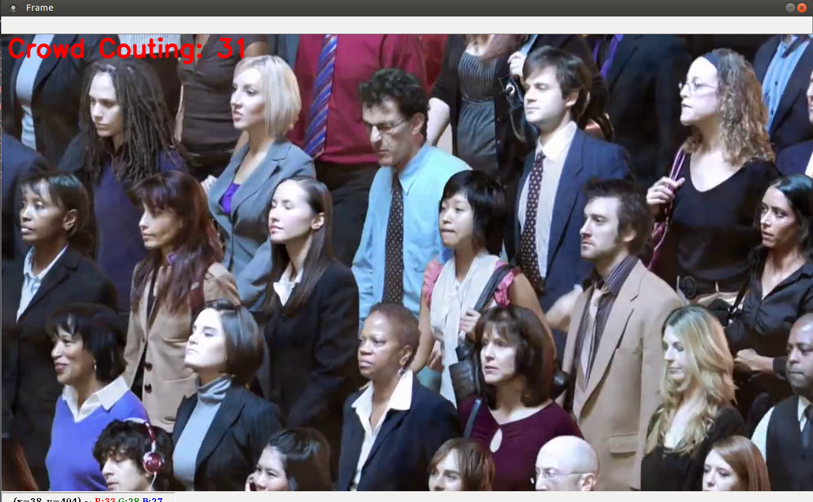

# Crowd_Couting_Live

Repository created for demonstration of a Crowd Couting algorithm in real time.



This repository uses the CANNet network to make inferences in real time. You can find out how to train, test, and other information about it in [this repository.](https://github.com/CommissarMa/Context-Aware_Crowd_Counting-pytorch)


# How to install

To install the required dependencies, you will need:

- Python 3.6 or higher
- pip

```
pip install -r requirements.txt
```


# How to run

Before running the application, it is important to understand what parameters the live_couting.py file receives


**--stream** *"url or path"*

Receives the string that represents your stream. This string can be a path to some video on your machine, your webcam id or even an RTSP url for a security camera.

**--weights** *"directory"*

It receives the directory where the pre-trained CANNet model file is located. By default, we make available in this repository a pre-trained model within the checkpoints folder provided by the repository mentioned above.

```
$ python live_couting.py --stream "url" --weights "path_to_weights"
```

# How to contribute

We appreciate all kind of contribution. If you find it necessary to increase some functionality, just fork the repository and create a pull request with the following information:

- What you added / removed / edited
- Why was this change necessary

If you have any questions, feel free to open an Issue.

